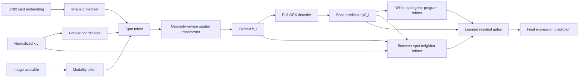

# SpatEX model flow

## Input contract

Each spot supplies a frozen 1,536-dimensional UNI2 embedding, normalized `(x,y)`
coordinates, and an image-availability flag. Measured expression is a training
target only; it is never an inference input.

## Full model



## Spatial image conditioner

For spot `i`, projected UNI2, Fourier coordinates, and modality flags form a
context token. Transformer attention exchanges image context between spots.
Relative `(dx,dy,distance)` is converted to an attention bias. Training fields
use dense attention when small; whole slides use local k-nearest attention to
bound memory.

## Within-spot refinement

The rank-64 basis `B` is fitted only on training expression after centering each
slide and balancing organs. This avoids making organ or slide offsets the main
gene programs.

For the base prediction `y0_i`:

```text
z_i       = ((y0_i - training_mean) / training_scale) B^T
delta_i   = MLP(z_i) B * training_scale
y_within  = y0_i + delta_i
```

This branch can change genes jointly along learned co-expression programs. It
does not read measured expression from the query spot.

## Between-spot refinement

The base prediction is compressed into predicted-GEX features and combined with
the image context. For every edge `i -> j` in a six-neighbor graph, attention
uses:

```text
current hidden state
neighbor hidden state
relative dx, dy, and distance
difference between predicted-GEX features
```

The weighted neighbor values produce a residual full-GEX update. This branch is
intended to preserve tissue domains and local expression gradients rather than
only smoothing values.

## Final output

```text
y = y0
  + sigmoid(g_within)  * (y_within  - y0)
  + sigmoid(g_between) * (y_between - y0)
```

The ablation study turns these modules off exactly, allowing local UNI2, spatial
image context, within-only, between-only, and full SpatEX to be compared under
the same data and objective.
